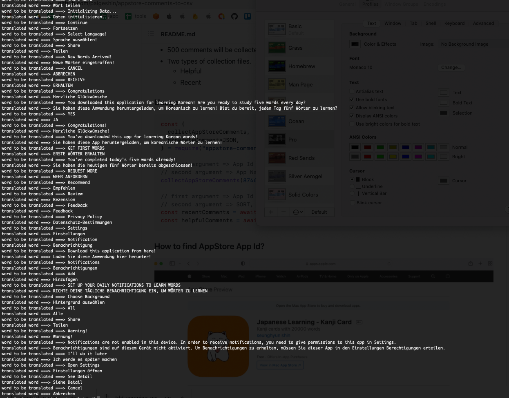

### Install

```bash
    npm install ios-translator
```

### Description

- Translation is executed upon Google Cloud.
- Translation quality wholly depends on Google Translate API
- Generate `localizable.strings`

### Features

- translate

  - translate single word or phrase or sentence

- fecthAvailableLanguages

  - fetch all available language lists for translation
  - returns json objects list for customization

- generateLocalizableStrings

  - generate localizable.strings for various languages
  - returns json objects list for cutomization

### Code Example

```jsx
// returns 'bonjour'
const result = await translate("hello", { from: "en", to: "fr" });

// returns objects (available languages for translation), [{ code: 'tk', name: 'Turkmen' }, { code: 'uk', name: 'Ukrainian' },]
const result = await fetchAvailableLanguages();

// returns objects and generate `localizable.strings`
// Object will look like this
/*
    {
        "ko": {
            "key": "hello",
            "value": "안녕하세요"
        }
    }
*/
const options = {
  input: "./ingredients/localizable.strings",
  output: "./data/",
  from: "en",
  to: ["fr", "ko"],
};
const translatedJSON = await generateLocalizableStrings(options);
```

### Configure

1. Create your google account
2. Enable Google Translate API
3. Create Service Account
4. Get json credential

```jsx
const jsonData = fs.readFileSync(
  "./your_google_service_account_credential.json"
);
const credential = JSON.parse(jsonData);
configure({
  googleApiCredential: credential,
  googleApiProjectId: credential.project_id,
  log: false,
});
```

### generateLocalizableStrings

- Options
  - input, where your original file is
  - output, where your output files will be
  - from, indicate your original language
    example) "hello world" is english
  - to, provide your target languages
    example) if you provide these languages, ["de", "fr"], your localizable.strings will be translated into german and french

```jsx
const options = {
  input: "./ingredients/localizable.strings",
  output: "./data/",
  from: "en",
  to: ["de", "fr"],
};
const translatedJSON = await generateLocalizableStrings(options);
```

- Output




